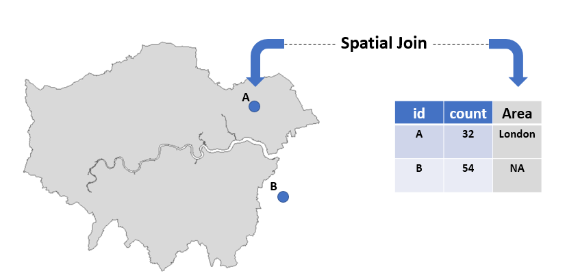

```{r, echo=FALSE}
htmltools::img(src = knitr::image_uri("data/img/small geo icon.png"), 
               alt = 'logo', 
               style = 'position:absolute; top:50px; right:0; padding:10px;')
```

```{r, echo=FALSE}
knitr::opts_chunk$set(fig.align="center")
```

```{r libraries, message=FALSE, warning=FALSE, echo=FALSE}
library("sf")
library("tidyverse")
library("tmap")
library("knitr")
```

## Set up

* In RStudio go to File -> New Project -> Existing Directory -> Downloaded Github repository.
* Run `getwd()` - the file path should end in "Introduction_to_GIS_in_R".
* Open a new script: File -> New File -> R Script.

## Quick R basics

* R is case sensitive - `read_csv` is not the same as `read_CSV`.
* New objects are created using the `<-` notation, e.g `new_object <- 2 * 5` .
* To overwrite an object use `<-` and its current name, e.g. `current_object <- st_union(current_object)`.
* Function's arguments have to be in `()` and they're defined with a `=`, e.g. `st_transform(x = lfb_sf, crs = 27700)`
* To see function's documentation precede its name with a `?`, e.g `?st_as_sf`.

## Install & load R libraries

If you have not installed the necessary packages run `install.packages()` and then load them using the `library()` function. 
```{r, eval=FALSE}
install.packages("sf", dependencies = TRUE, type = "win.binary")
install.packages("tmap", dependencies = TRUE, type = "win.binary")
install.packages("tidyverse", dependencies = TRUE, type = "win.binary")

library(sf) 
library(tmap)
library(tidyverse)
```


## Aims

**By the end of the course you will: **
 
* Know got to load spatial data into R using the `sf` library.
* Be familiar with using GSS codes to join statistics to geographies.
* Understand how spatial objects can be manipulated using `tidyverse`.
* Understand how to use spatial joins. 
* Be aware of map projections and Coordinate Reference Systems (CRS) and be able to modify them.
* Know how to make static and interactive maps in `tmap`.
* Be able to export your maps and shapefiles.


## GIS and R

R is commonly used for statistical analysis and programming, however it also has a range of geospatial libraries developed by a community of researchers and programmers. In the last few years, working with spatial data became much easier in R, with the development of the `sf` package. `sf` keeps all the spatial information for each observation in a geometry column which means that we can treat it like a normal data frame and also perform spatial operations on the data.  

```{r echo=FALSE}
wd_2019_bgc <- st_read("data/shp/Wards_December_2019_Boundaries_EW_BGC/Wards_December_2019_Boundaries_EW_BGC.shp", quiet = TRUE) %>% 
  select(wd19cd, wd19nm)
head(wd_2019_bgc)
```


# London Fire Brigade Animal Rescue Data

Throughout this tutorial you will be using data from the London Fire Brigade - [LFB Animal Rescue Data](https://data.london.gov.uk/dataset/animal-rescue-incidents-attended-by-lfb). It covers all incidents between 2009 and 2020 which included assistance to animals that may be trapped or in distress. The data is updated monthly and includes a range of variables for each incident including some location information (postcode, borough, ward),the date/time of the incidents, cost, and type of animal in trouble. 

We want to visualise, and better understand how much money has been spent on animal related incidents between 2009 and 2020, and what the distribution is at the MSOA level of geography. To achieve this we will have to import spatial data, manipulate it, create summary statistics, and then plot it.

## Loading spatial and non-spatial data

LFB data has been tidied up and saved as a Comma Separated Value file (.csv). We can use `read_csv` to open it in R.

### Exercise - open LFB data

* Create a new object called `lfb` by using `read_csv()`. Load data located in "data/csv/lfb_2009_2020.csv".
* Use `glimpse()` or `head()` to view `lfb` structure.

**Solution**
```{r message=FALSE}
lfb <- read_csv("data/csv/lfb_2009_2020.csv")
head(lfb)
```

`lfb` is currently just a data frame - it has not got an explicit geometry column which links observations to their geographic location. It does however contain several columns which can be used to convert it into a spatial data format.   

**Ward_code** column references the GSS codes of wards within which the observations fall. GSS codes can be used to join `lfb` data to boundaries from the Open Geography Portal. One issue with this particular column is that it does not indicate the currency of GSS codes. Wards are subject to frequent change, and as such it is best practice to be clear about the dates of any boundaries used by stating the exact code used, e.g. **wd19cd**. Because LFB data does not include this information we have no guarantee that the boundaries and GSS codes we join will match.  

Fortunately we have also been provided with columns recording the **easting**, and **northing** of each incident. We can use those to convert `lfb` into an `sf` object. To achieve this we will use the `st_as_sf()` function which takes the following arguments:

`new_object <- st_as_sf(x = input_data_frame, coords = c("x_coordinate_column", "y_coordinate_column"), crs = 27700)`

### Exercise - create spatial data

* Create a new object called `lfb_sf` by converting `lfb` using the `st_as_sf()` function.
* Use `glimpse()` or `head()` to view `lfb_sf` structure.

**Solution**
```{r}
lfb_sf <- st_as_sf(x = lfb, coords = c("easting", "northing"), crs = 27700)
head(lfb_sf)
```

`st_as_sf()` converted the **easting** and **northing** columns to simple feature geometries and created a new column called **geometry** which holds spatial information for each row. 
Now that `lfb` is a spatial object we can plot it using the `tmap` package. For now we will use the `qtm()` function which creates a quick map, using `tmap's` default settings. `qtm()` only needs to be supplied with a simple feature object and is very useful for quickly inspecting your data. To quickly plot multiple layers on the same map use `qtm() + qtm()`. 

### Exercise - quick static maps

* Plot lfb_sf using the `qtm()` function.

**Solution**
```{r}
qtm(lfb_sf)
```


We can also create interactive maps using the `tmap`, package by running `tmap_mode("view")` before executing `qtm()`. 
To reverse it and go back to static maps use `tmap_mode("plot")`.

### Exercise - quick interactive maps

* Make an interactive map of `lfb_sf` using the `qtm()` function and `tmap_mode("view")`.

**Solution**
```{r, message=FALSE}
tmap_mode("view")
qtm(lfb_sf)
```

## Filtering by GSS code

It looks like some of the locations are located outside of London, however we are only interested in incidents within the Boroughs making up Greater London. To remove all points outside of London we will have to import a shapefile with Upper Tier Local Authorities (UTLA) and then use them to spatially filter `lfb_sf` data. 

So far we have created our own `sf` objects by adding a geometry column. The UTLA data set is already a spatial one and as such we can use the `st_read()` function from the `sf` package to import it. `st_read` is extremely versatile and able to import most spatial data formats into R. The only argument that needs to be supplied to `st_read` is the full path to the UTLA boundaries 

### Exercise - loading shapefiles

* Use `st_read()` to load the UTLA boundaries you downloaded at the beginning of the tutorial, as`utla_2019`.
* UTLA path - `data/shp/London_2019/London_and_surrounding_UTLAs.shp`
* Make a static map of the object you have just created using `qtm()` and setting `tmap_mode("plot")`.

**Solution**
```{r, message = FALSE}
utla_2019 <- st_read("data/shp/London_2019/London_and_surrounding_UTLAs.shp")
tmap_mode("plot")
qtm(utla_2019)

```

UTLA boundaries have loaded correctly but they currently cover London as well as some of the surrounding UTLAs. Because simple feature objects are data frames with a geometry column attached, any operations that we would perform on a normal data frame can also be performed on an object of class `sf`. Here we will use the `dplyr::filter` and `stringr::str_detect()` from the the `tidyverse` package to only keep UTLAs whose GSS code starts with "E09". "E09" denotes that an entity is a London Borough.


### Exercise - filter spatial data by variable

* Inspect utla_2019 using `head()` or `glimpse()`, and identify which column holds the GSS codes - it should end in "cd".
* Create a new object called `london_utla`. Use `dplyr::filter` alongside `stringr::str_detect()` to only keep observations which have a GSS code starting with "E09".
* Plot `london_utla` to see if the results look correct.

**Solution**
```{r}
head(utla_2019)
```

```{r}
london_utla <- filter(utla_2019, str_detect(ctyua19cd, "E09"))
qtm(london_utla)
```

Finally, for the next step, we only need the outer boundary of London - all the internal UTLA boundaries have to be removed and only the outer edges kept. `sf` has a function exactly for this purpose called `st_union()`. 
It only takes one argument, which is the `sf` object we want to merge. 

### Exercise - dissolve boundaries

* Create a new object called `london_boundary` using the `st_union` function.
* Plot it to check the results.

**Solution**
```{r}
london_boundary <- st_union(london_utla)
qtm(london_boundary)
```


## Spatial subsetting and CRS

In addition to subsetting by value, as we did with the UTLA boundaries earlier, we can also subset observations by evaluating their spatial relationship with another data set. We can for example select all UTLAs which are fully within Wales, every Output Area intersected by a river, or all households outside of city boundaries. There are a number of different spatial relationships which can be tested and used to subset observations.

<center>
 
</center>


`sf` has an inbuilt function called `st_filter()` which we can use to spatially subset observations.
The function takes several arguments:

* x - `sf` data frame we want to subset - `lfb_sf`
* y - `sf` object used to evaluate the spatial relationship - `london_boundary`

Before running any spatial operations on two spatial objects it is always worth checking if their coordinate reference systems (CRS) match. `sf` will throw an error if that's not the case. Try it for yourself below.

### Exercise - spatial subset part 1 

* Use `st_filter()` to spatially subset `lfb_sf` by testing its relationship with `london_boundary`.

**Solution:**
```{r, eval=FALSE}
lfb_sf <- st_filter(x = lfb_sf, y = london_boundary)

```

You should have got an error here saying `x st_crs(x) == st_crs(y) is not TRUE`. It means that objects x and y have different coordinate reference systems. Spatial operations require all objects to have the same CRS. We can see this for ourselves by running the `st_crs()` function, which returns the coordinate reference system of an object.

### Exercise  - check CRS

* Run `st_crs()` on both and `lfb_sf` and `london_boundary` and compare the results.

**Solution:**
```{r}
st_crs(lfb_sf)[[1]]

st_crs(london_boundary)[[1]]

```

`st_crs()` provides detailed information about the CRS and projection of data, but all we need to check is its first element denoted by `[[1]]`. We can see that `lfb_sf` uses `EPSG:27700`, while `london_boundary` is set to `WGS 84`. This problem can be solved by transforming `london_boundary`'s CRS to match that of `lfb_sf`, simply by using the correct EPSG code. To do so we will use the `st_transform()` function which takes two arguments: 

* x - `sf` object to be transformed
* crs - EPSG code that we want to transform our data to - BNG is 27700.

### Exercise - transform CRS

* Run `st_transform()` to transform and overwrite `london_boundary`. Remember to set the correct CRS. 
* Run `st_crs()` on `lfb_sf` and newly transformed `london_boundary` and compare the results.

**Solution:**

```{r}
london_boundary <- st_transform(london_boundary, crs = 27700)

st_crs(lfb_sf)[[1]]
st_crs(london_boundary)[[1]]
```


Now that the CRS are matching we should be able to spatially subset `lfb_sf`.

### Exercise - spatial subset part 2 

* Use `st_filter` to spatially subset `lfb_sf` by testing its relationship with `london_boundary`. Overwrite `lfb_sf` with the subset data.
* Plot it to check if the results are correct - all points should be within London.

**Solution:**
```{r}
lfb_sf <- st_filter(x = lfb_sf, y = london_boundary)
 qtm(london_boundary) + qtm(lfb_sf)
```


## Spatial and non-spatial joins

Simple features data can be joined to other data sets in two ways. We can either use a traditional, SQL like join, based on a value shared across the data sets or, since we have a geometry column, on the spatial relationship between the data sets. This is known as a spatial join, where variables from one data set are joined to another only on the basis of their spatial relationship. The most commonly used operation is known as a Point-in-Polygon join where data from a polygon is joined to the points within them.

<center>

</center>  
  
  

In `sf` spatial joins are handled using the `st_join(x, y)` function with arguments:

* x - `sf` object to which we are joining data (LHS in SQL)
* y - `sf` object whose variables are being joined (RHS in SQL)

We will be joining the Middle Super Output Areas to LFB locations, which will then allow us to group and plot data at MSOA level.

### Exercise - spatial joins

* Read in `data/shp/MSOA_2011_london/MSOA_2011_BFE_London.gpkg` as `msoa_london` - use `st_read()`
* Create a new object called `lfb_msoa_sf` by running `st_join()` between `lfb_sf` and `msoa_london`
* Inspect your new object using `head()` or `glimpse()` to see what columns have been added.

```{r}
msoa_london <- st_read("data/shp/MSOA_2011_london/MSOA_2011_BFE_London.gpkg", quiet = TRUE)

lfb_msoa_sf <- st_join(lfb_sf, msoa_london)

head(lfb_msoa_sf)
```


Now that `MSOA11CD` is attached to our observations we can create summary statistics for each MSOA. As mentioned before, we can use standard `tidyverse` functions on `sf` objects. Here, we will use `dplyr` to calculate the total number of incidents and their cost, and then use a non spatial join to attach those results to MSOA boundaries. At this stage we no longer need the geometry column for each LFB incident as a) we're not performing any spatial operations on our points, and b) the geometry column can slow down/interrupt the `dplyr::group_by` function which we will be using. To remove the geometry column we use the `st_drop_geometry()` function directly in the `dplyr` pipe. 

### Exercise - MSOA summary statistics

* Use `st_drop_geometry()` on `lfb_msoa_sf` to remove geometry data. 
* Create summary statistics per MSOA - sum of `cost_gbp` as `total_cost` (use `na.rm = TRUE`), and the total number of incidents as `n_cases`. You will need to use `group_by()` and `summarise()`
* Use `mutate` to create a new column called `cost_per_incident` which is equal to `total_cost` divided by `n_cases`.
* Join `lfb_msoa_stats` to `msoa_london`, using `left_join()` and create a new object `msoa_lfb`

```{r, message=FALSE}
lfb_msoa_stats <- lfb_msoa_sf %>% 
                  st_drop_geometry() %>% 
                  group_by(MSOA11CD) %>% 
                  summarise(total_cost = sum(cost_gbp, na.rm=TRUE), n_cases = n()) %>% 
                  mutate(cost_per_incident = total_cost/n_cases)
                         

msoa_lfb <- left_join(msoa_london, lfb_msoa_stats)
msoa_lfb
```

At this stage it is a good idea to save our data. We can do this using the `st_write()` function. It needs an `sf` object and the path and name of the output.

### Exercise - save data to gpkg

* Copy and execute the following code to save your data: `st_write(msoa_lfb,"output/msoa_lfb.gpkg)`


# Making better maps

Now that we have processed our data we can start mapping it. So far we have only used the `qtm()` function from the `tmap` package. This creates a default map and is great when all we want to do is quickly visualise our data. The full range of `tmap` functions gives us control over all elements of the final plot and allows us to create high quality maps.

```{r, fig.align='center', message=FALSE}
tmap_mode("plot")

tm_shape(msoa_lfb) + 
  tm_polygons(col = "total_cost", border.col = "#4a4949", lwd = 0.05, title = "Total cost (£)", palette = "Blues", contrast = 1, legend.hist = TRUE,
        labels = c("0 - 2,000", ">2,000 - 4,000", ">4,000 - 6,000", ">6,000 - 8,000", ">8,000 - 10,000", 
                   ">10,000 - 12,000", ">12,000 - 14,000")) +
  tm_scale_bar(position = c(0,0), text.size = 0.7) +
  tm_layout(main.title = "Cost of animal related incidents per MSOA, between 2009 and 2020",  main.title.position =  c(0,0), main.title.size = 1, main.title.fontface = "bold", frame = FALSE, legend.position  = c(0.08,0.18),
            inner.margins = c(0.1,0.05,0.1,0.02), legend.outside = TRUE, legend.title.size  = 1, legend.text.size =  0.7, title.snap.to.legend = FALSE) +
  tm_shape(london_boundary) + tm_borders(col = "black", lwd = 0.25)
```


`tmap` follows similar principles to `ggplot2`, where we first specify the data source - `tm_shape`, then the aesthetics of the plot - `tm_polygons`, `tm_dots`, etc., and then we make any final adjustments - `tm_layout`. All functions need to be connected using the `+` symbol.

* `tm_shape()` - `sf` object which you want to plot
* `tm_fill()`, `tm_borders()`, `tm_polygons()`, `tm_dots()` - types of output
* `tm_layout()` - controls layout of the map, titles, labels, etc.

`tmap` syntax: `tm_shape(sf_object) + tm_borders(col = either "colour" or name of column which we want to plot) + tm_layout(main.title = "title of your map")`

### Guided exercise - mapping

Start by specifying which `sf` object is being mapped in `tm_shape()` and what column holds the values to be visualised. We will also change the legend's title.
```{r}
tm_shape(msoa_lfb) + 
  tm_polygons(col = "cost_per_incident", title = "Cost per Incident (£)")
```

Now let's add `london_boundary` to have a thicker line around London.
```{r}
tm_shape(msoa_lfb) + 
  tm_polygons(col = "cost_per_incident", title = "Cost per Incident (£)") + 
  tm_shape(london_boundary) + tm_borders(col = "black", lwd = 2)
```

Next we will add a scale bar and position it in the bottom left corner.
```{r}
tm_shape(msoa_lfb) + 
  tm_polygons(col = "cost_per_incident", title = "Cost per Incident (£)") + 
  tm_shape(london_boundary) + tm_borders(col = "black", lwd = 2) +
  tm_scale_bar(position = c(0,0))
```

We can now remove the black frame from the map and add a title to our map.
```{r}
tm_shape(msoa_lfb) + 
  tm_polygons(col = "cost_per_incident", title = "Cost per Incident (£)") + 
  tm_shape(london_boundary) + tm_borders(col = "black", lwd = 2) +
  tm_scale_bar(position = c(0,0)) +
   tm_layout(title = "Average cost of animal related incidents between 2009 and 2020",  
            frame = FALSE)
```

All of the map elements are now visible but they're not in the right place. We can solve this by increasing the margins around our map. This will allow the title and the legend to move outwards.

```{r}
tm_shape(msoa_lfb) + 
  tm_polygons(col = "cost_per_incident", title = "Cost per Incident (£)") + 
  tm_shape(london_boundary) + tm_borders(col = "black", lwd = 2) +
  tm_scale_bar(position = c(0,0)) +
   tm_layout(title = "Average cost of animal related incidents between 2009 and 2020",  
            frame = FALSE, inner.margins = c(0.1,0.1,0.1,0.15))

```


`tmap` breaks up numerical data into evenly sized categories by default, but you can provide it with custom breaks as well. 
```{r}
tm_shape(msoa_lfb) + 
  tm_polygons(col = "cost_per_incident", breaks = seq(0,1200,300), title = "Cost per Incident (£)") + 
  tm_shape(london_boundary) + tm_borders(col = "black", lwd = 2) +
  tm_scale_bar(position = c(0,0)) +
   tm_layout(title = "Average cost of animal related incidents between 2009 and 2020",  
            frame = FALSE, inner.margins = c(0.1,0.1,0.1,0.15))
```

You can also use other methods of automatic data categorisation. `Jenks` is a popular method for clustering data into classes. You can set the number of desired classes using the `n` argument, and the exact method with the `style` argument.
```{r}
tm_shape(msoa_lfb) + 
  tm_polygons(col = "cost_per_incident", n = 4, style ="jenks", title = "Cost per Incident (£)") + 
  tm_shape(london_boundary) + tm_borders(col = "black", lwd = 2) +
  tm_scale_bar(position = c(0,0)) +
   tm_layout(title = "Average cost of animal related incidents between 2009 and 2020",  
            frame = FALSE, inner.margins = c(0.1,0.1,0.1,0.15))
```


We will use the manually set breaks to ensure consistent results.
It's also important to change the legend labels to ensure there are no overlapping values.
```{r}
tm_shape(msoa_lfb) + 
  tm_polygons(col = "cost_per_incident",  breaks = seq(0,1200,300), title = "Cost per Incident (£)",
              labels = c("0 - 300", ">300 - 600", ">600 - 900", ">900 - 1200")) + 
  tm_shape(london_boundary) + tm_borders(col = "black", lwd = 2) +
  tm_scale_bar(position = c(0,0)) +
   tm_layout(title = "Average cost of animal related incidents between 2009 and 2020",  
            frame = FALSE, inner.margins = c(0.1,0.1,0.1,0.15))
```


Finally let's change the colour of our map and increase the contrast. Choose a colour from [R Colours](https://www.r-graph-gallery.com/38-rcolorbrewers-palettes_files/figure-html/thecode-1.png).

```{r}
tm_shape(msoa_lfb) + 
  tm_polygons(col = "cost_per_incident",  breaks = seq(0,1200,300), title = "Cost per Incident (£)",
              labels = c("  0 - 300", ">300 - 600", ">600 - 900", ">900 - 1200"), palette = "Blues", contrast = 1) + 
  tm_shape(london_boundary) + tm_borders(col = "black", lwd = 2) +
  tm_scale_bar(position = c(0,0)) +
   tm_layout(title = "Average cost of animal related incidents between 2009 and 2020",  
            frame = FALSE, inner.margins = c(0.1,0.1,0.1,0.15))
```


Finally, save your map as an R object and export it.

```{r}
average_cost <- tm_shape(msoa_lfb) + 
  tm_polygons(col = "cost_per_incident",  breaks = seq(0,1200,300), title = "Cost per Incident (£)",
              labels = c("  0 - 300", ">300 - 600", ">600 - 900", ">900 - 1200"), palette = "Blues", contrast = 1) + 
  tm_shape(london_boundary) + tm_borders(col = "black", lwd = 2) +
  tm_scale_bar(position = c(0,0)) +
   tm_layout(title = "Average cost of animal related incidents between 2009 and 2020",  
            frame = FALSE, inner.margins = c(0.1,0.1,0.1,0.15))
```
```{r, eval=FALSE}
tmap_save(average_cost, "output/maps/average_cost_msoa.png", width = 8, height = 5)
```

You can also view your choropleth as an interactive map. It helps to add an `alpha` argument to change your map's transparency.

```{r}
tmap_mode("view")
tm_shape(msoa_lfb) + 
  tm_polygons(col = "cost_per_incident", breaks = seq(0,1200,300), 
               labels = c("  0 - 300", ">300 - 600", ">600 - 900", ">900 - 1200"),
              title = "Cost per Incident (£)", palette = "Blues", contrast = 1, alpha = 0.8) + 
  tm_shape(london_boundary) + tm_borders(col = "black", lwd = 2) 
```

# Recommended resources

[Geocomputation with R](https://geocompr.robinlovelace.net/index.html)  

[Simple Features for R](https://r-spatial.github.io/sf/index.html)  

[Spatial Data Science with R](https://www.rspatial.org/)  

[Creating demographic maps in R with tmap packages](http://www.zevross.com/blog/2018/10/02/creating-beautiful-demographic-maps-in-r-with-the-tidycensus-and-tmap-packages/)
